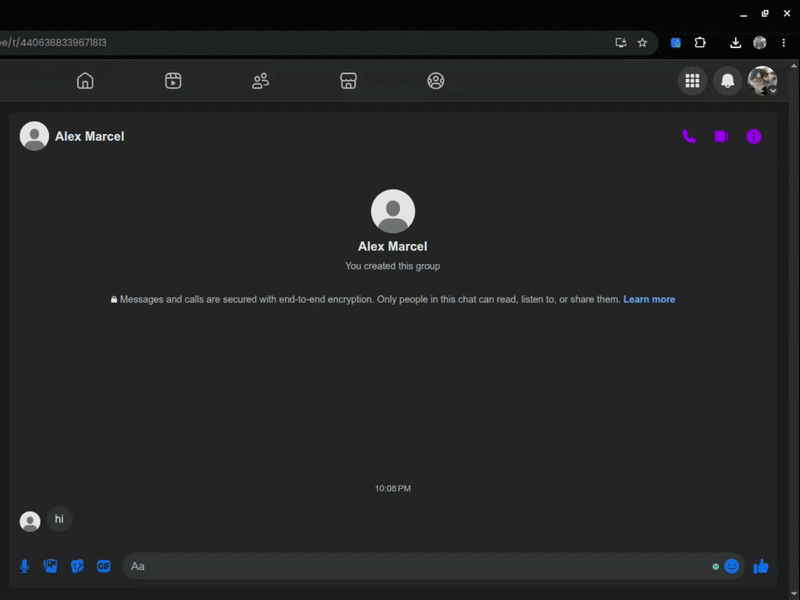
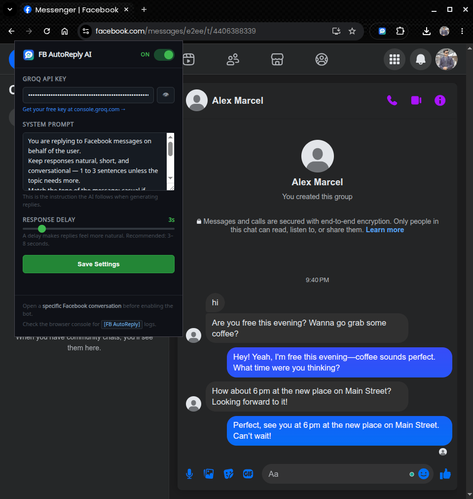

<h1 align="center">
    
    <div>FB AutoReply AI</div>
</h1>

<p align="center">
  A Manifest V3 Chrome extension that watches an open Facebook Messenger conversation,
  sends recent chat context to Groq, and replies automatically in Messenger.
</p>

<p align="center">
  <a href="https://developer.chrome.com/docs/extensions/mv3/">
    
  </a>

  <a href="https://console.groq.com/">
    
  </a>

  <a href="https://developer.mozilla.org/docs/Web/JavaScript">
    
  </a>

  <a href="https://developer.chrome.com/docs/extensions/">
    
  </a>
</p>

> **Note:** The demo GIF was recorded before the latest icon redesign. Functionality remains the same.

<p align="center">
  
</p>

> **⚠️ Note:**
>
>This project is an experimental learning project and is intended for educational and personal use.This extension interacts with Facebook Messenger and may be treated as automated messaging behavior. Facebook's policies can change, and misuse may increase the risk of account restrictions or temporary limitations. Use it cautiously, keep it personal and limited, and avoid spammy or unsolicited behavior.

---

## Table of Contents 📋

- [What It Does](#what-it-does)
- [How It Works](#how-it-works)
- [Architecture](#architecture)
- [Features](#features)
- [Requirements](#requirements)
- [Installation](#installation)
- [Setup](#setup)
- [Prompt Tips](#prompt-tips)
- [Everyday Use](#everyday-use)
- [Logging](#logging)
- [Troubleshooting](#troubleshooting)
- [Privacy and Security](#privacy-and-security)
- [Responsible Use](#responsible-use)
- [Changing the Model](#changing-the-model)
- [Development Notes](#development-notes)
- [Project Background](#project-background)
- [Known Limitations](#known-limitations)
- [License](#license)

---

<a id="what-it-does"></a>

## What It Does ✨

FB AutoReply AI helps you respond to Messenger chats while a conversation is open in your browser.

- Detects new incoming messages in Facebook Messenger
- Builds a short chronological conversation history
- Sends that history to the Groq Chat Completions API from the background service worker
- Types the generated reply into Messenger
- Sends the reply automatically after your configured delay
- Preserves your custom system prompt so the response style can sound more like you

The extension is intentionally small and local: no custom backend, no database, and no project-specific tracking layer.

---

<a id="how-it-works"></a>

## How It Works 🔧

```text
Messenger page
    |
    | content.js observes newly added message nodes
    v
content.js extracts incoming messages and conversation history
    |
    | chrome.runtime.sendMessage(...)
    v
background.js calls Groq Chat Completions
    |
    | AI reply
    v
content.js types into Messenger and sends
```

---

<a id="architecture"></a>

## Architecture 🧱

| File                             | Purpose                                                                                                               |
| -------------------------------- | --------------------------------------------------------------------------------------------------------------------- |
| [`manifest.json`](manifest.json) | Manifest V3 configuration, permissions, content script matches, and service worker registration                      |
| [`content.js`](content.js)       | Runs on Messenger pages, detects incoming messages, extracts conversation history, types replies, and sends messages |
| [`background.js`](background.js) | Service worker that calls Groq. API calls stay here to avoid content-script CORS problems                            |
| [`popup.html`](popup.html)       | Extension popup UI                                                                                                   |
| [`popup.css`](popup.css)         | Popup styling                                                                                                        |
| [`popup.js`](popup.js)           | Loads and saves settings, API key, prompt, delay, and enabled state                                                  |
| [`assets/`](assets/)             | Extension logo, Chrome icon sizes, and README banner                                                                 |

---

<a id="features"></a>

## Features 🚀

- **Efficient message detection** - observes only newly added DOM nodes instead of rescanning the full Messenger page on every mutation.
- **Duplicate protection** - uses processed DOM nodes, recent message text tracking, cooldown timing, and an in-flight response lock.
- **Context-aware replies** - sends recent conversation history in chronological order.
- **Configurable personality** - system prompt controls tone, language behavior, and response style.
- **Configurable delay** - adds a natural pause before replying.
- **Messenger SPA support** - reconnects the observer when Facebook changes conversations without a full page reload.
- **Typing fallback chain** - tries `execCommand("insertText")`, then paste simulation, then direct text assignment.
- **Send fallback chain** - tries the Send button first, then falls back to the Enter key.
- **Popup settings** - stores API key, system prompt, delay, and enabled state with `chrome.storage.sync`.

---

<a id="requirements"></a>

## Requirements ✅

- Google Chrome or other Chromium browsers that support Manifest V3.
- A Facebook account with Messenger access.
- An API key:
    - Create an API key from [_Groq_](https://console.groq.com/keys)
    - Your key should start with `gsk_`

---

<a id="installation"></a>

## Installation 📦

1. Open `chrome://extensions`
2. Toggle on **Developer mode**
3. Click **Load unpacked**
4. Select this project folder: `fb-autoreply-extension`
5. Pin the extension from the browser toolbar if you want quick access

---

<a id="setup"></a>

## Setup ⚙️

<p align="center">
  
</p>

1. Click the extension (puzzle) icon in your browser toolbar
2. Paste your Groq API key
3. Edit the system prompt if you want a different tone
4. Choose a response delay. A range of 3 to 8 seconds usually feels natural
5. Click **Save Settings**
6. Open a specific Messenger conversation
7. Turn the extension toggle **ON**
8. Refresh the page

When a new incoming message arrives, the extension waits for the configured delay, asks Groq for a reply, types it, and sends it.

---

<a id="prompt-tips"></a>

## Prompt Tips 💡

#### The System Prompt 📜

The system prompt is the biggest lever for reply quality. Keep it specific, practical, and honest about the style you want.

Example:

```text
You are replying to Facebook messages on behalf of Mr. David.
Keep replies warm, casual, and concise.
Use the same language as the sender.
Never reveal you are an AI or a bot.
If you're unsure what to say, ask a simple follow-up question.
```

Good prompts usually define:

- Reply length
- Tone
- Language behavior
- Boundaries for sensitive topics
- Whether to ask follow-up questions

#### Personal Context 🧠

You can add a short personal profile to the system prompt so the AI has more context about you and can write more personalized replies. Include only details you are comfortable sending to Groq.

Useful details:

- Your name or preferred nickname
- Your usual tone, such as friendly, direct, playful, formal, or calm
- Languages you commonly use
- Your role, work, school, or business context
- Your typical availability and response habits
- Topics, phrases, or personal details the AI should avoid

Example:

```text
Personal context:
My name is Mr. David. I run a small design studio and usually reply in a warm,
direct style. I speak English and French. I am usually available after 6 PM,
so if someone asks for a call during work hours, suggest evening instead.
Do not share private financial, family, or account details.
```

---

<a id="everyday-use"></a>

## Everyday Use 📱

1. Open [`https://www.facebook.com/messages`](https://www.facebook.com/messages) or [`https://www.messenger.com`](https://www.messenger.com)
2. Click into one specific conversation
3. Enable the extension from the popup
4. Leave that conversation open

To stop replying, turn the popup toggle **OFF** or close the Messenger tab.

---

<a id="logging"></a>

## Logging 📝

Open DevTools on the Messenger tab and check the Console. Meaningful runtime logs use the prefix `[FB AutoReply]`.

Typical flow:

```text
[FB AutoReply] Settings loaded. Bot enabled: true
[FB AutoReply] Initializing...
[FB AutoReply] Pre-loaded 4 existing messages as seen.
[FB AutoReply] Observer active. Watching for incoming messages...
[FB AutoReply] Ready!
[FB AutoReply] Detected 4 new incoming message(s).
[FB AutoReply] New incoming message: Are you free this evening? Wanna go grab some coffee?
[FB AutoReply] Waiting 3.0s before responding...
[FB AutoReply] Calling Groq with 5 messages of context...
[FB AutoReply] Got reply: Hey! Yeah, I'm free this evening—cofee sounds perfect. What ime were you thinking?
[FB AutoReply] Sent via Enter key.
[FB AutoReply] Reply sent successfully!
```

---

<a id="troubleshooting"></a>

## Troubleshooting 🔎

| Problem                  | What to Check                                                                                                              |
| ------------------------ | -------------------------------------------------------------------------------------------------------------------------- |
| Extension does not reply | Confirm the popup toggle is ON, API key is saved, and a specific conversation is open                                     |
| API key error            | Make sure the key starts with `gsk_` and has not been deleted from Groq                                                   |
| No messages detected     | Refresh Messenger, reopen the conversation, and wait a few seconds for initialization                                     |
| Replies are too long     | Tighten the system prompt and ask for 1 to 2 sentence replies                                                             |
| Replies sound unlike you | Add style examples to the prompt, such as "friendly, direct, lightly casual"                                              |
| It replies twice         | Refresh the page, as the extension has duplicate protection, but Facebook re-renders can still be noisy after layout changes |
| Send button fails        | The extension falls back to Enter; if both fail, Facebook may have changed its composer DOM.                               |

---

<a id="privacy-and-security"></a>

## Privacy and Security 🔒

- Your Groq API key is stored with `_chrome.storage.sync_`
- Message text from the active conversation is sent to Groq only when generating a reply
- API calls are made by [`background.js`](background.js), not by the content script
- The extension does not include a custom analytics service
- Anyone with access to your Chrome profile may be able to access extension settings, so protect your browser profile

Review Groq's data and privacy policies before using the extension with sensitive conversations.

---

<a id="responsible-use"></a>

## Responsible Use ⚖️

Automation on messaging platforms can be sensitive. Use this project for personal experiments, demos, or controlled workflows. Review Facebook/Messenger rules before using it on important accounts, business accounts, or high-volume conversations.

Do not use auto-replies for spam, impersonation, harassment, scams, or anything that would surprise people in a harmful way. Even when used responsibly, automated messaging can still attract attention from platform moderation systems, so keep volume low and stay transparent about your intent.

---

<a id="changing-the-model"></a>

## Changing the Model 🔄

The model is configured in [`background.js`](background.js#L26):

```js
model: "llama-3.1-8b-instant",
```

You can replace it with another Groq chat model. After changing the file, reload the unpacked extension from your browser extensions page and refresh the Facebook/Messenger page you're using.

Read Groq model documentation [_here_](https://console.groq.com/docs/models).

---

<a id="development-notes"></a>

## Development Notes 🛠️

- Keep Groq calls in `background.js`
- Keep Messenger DOM observation and typing behavior in `content.js`
- Keep popup settings in the popup files
- Avoid full-document scans in mutation callbacks
- Keep conversation history chronological: oldest message first, newest message last
- Test on both `facebook.com/messages` and `messenger.com` when changing selectors

Quick syntax checks:

```bash
node --check content.js
node --check background.js
node --check popup.js
```

---

<a id="project-background"></a>

## Project Background 🧪

This project was built as a personal learning exercise and experiment in browser extension development and LLM integration.

The initial implementation, architecture, and much of the code were created with extensive assistance from modern AI coding tools, including Claude, ChatGPT, and GitHub Copilot. Rather than writing every component from scratch, I used these tools to rapidly prototype the extension, iteratively debug issues, and improve the implementation through many rounds of testing.

My role throughout the project included:

- Defining the project's functionality and overall goal
- Testing every feature and identifying failures
- Investigating browser behavior using DevTools and runtime logging
- Debugging issues related to Messenger's DOM, MutationObserver behavior, Chrome extension messaging, and Manifest V3 service workers
- Integrating, modifying, and validating AI-generated code until the extension behaved as intended
- Writing and refining the documentation

I do not claim to have written every line of code manually. As AI-assisted development becomes increasingly common, I believe transparency is more valuable than pretending every line was written manually. This repository is intentionally presented as an honest record of that learning process.

---

<a id="known-limitations"></a>

## Known Limitations ⚠️

- Facebook changes its DOM frequently, so selectors may need maintenance
- The bot works on the currently open conversation, not every conversation in the sidebar
- It needs the Messenger page and conversation open to observe new messages
- It is designed for text replies. Media, stickers, reactions, and attachments are intentionally ignored
- Service workers in Manifest V3 can sleep and wake, so the first reply after inactivity may take a little longer

---

<a id="license"></a>

## License 📄

This project is licensed under the **MIT License** - see the [_LICENSE_](LICENSE) file for details.
